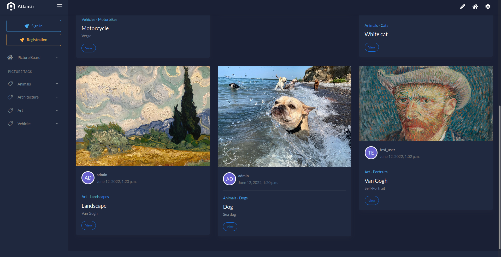
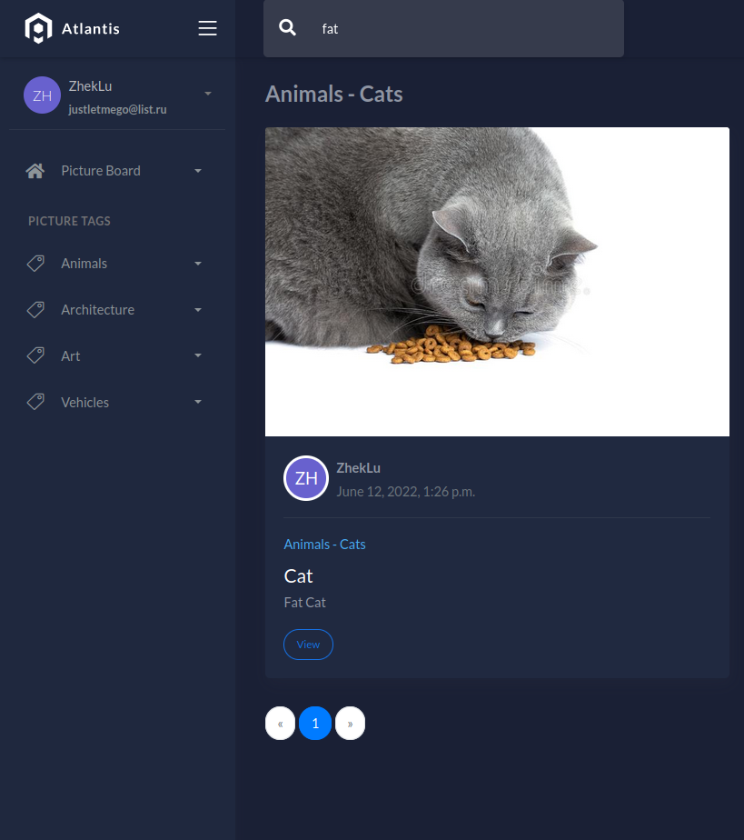
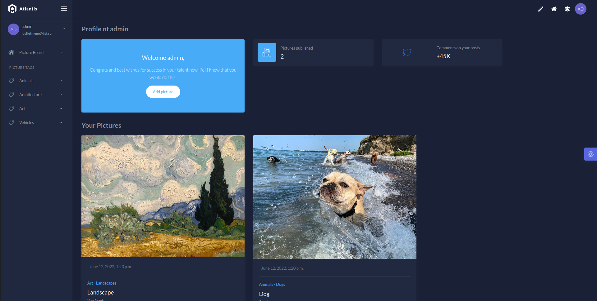
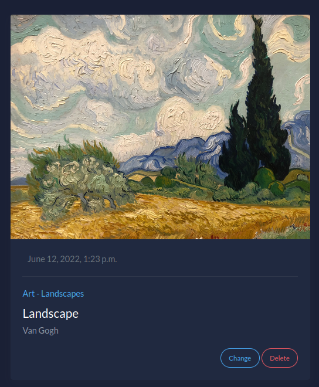
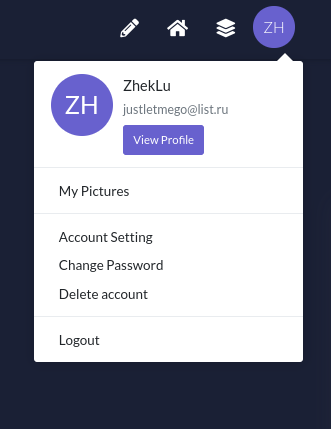
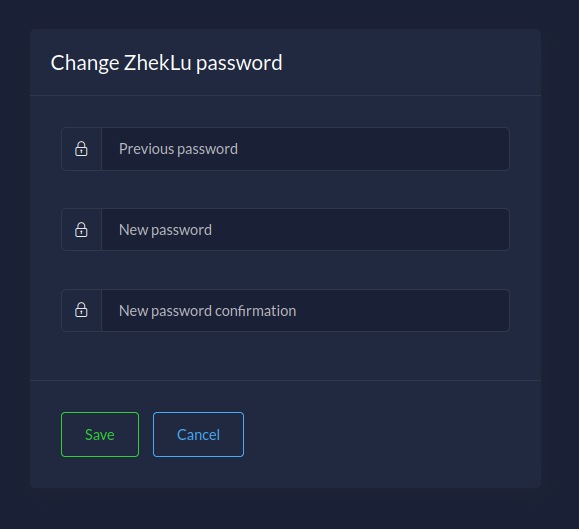
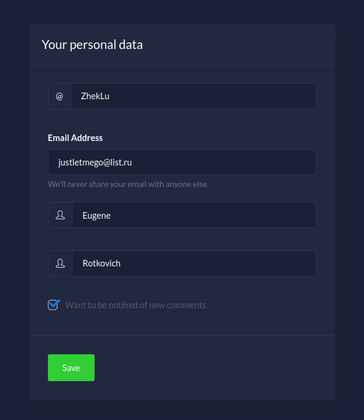
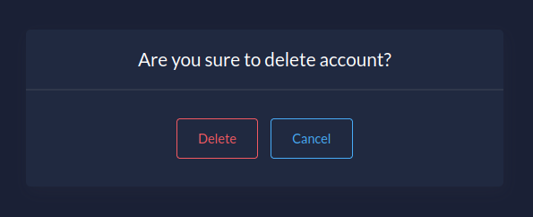
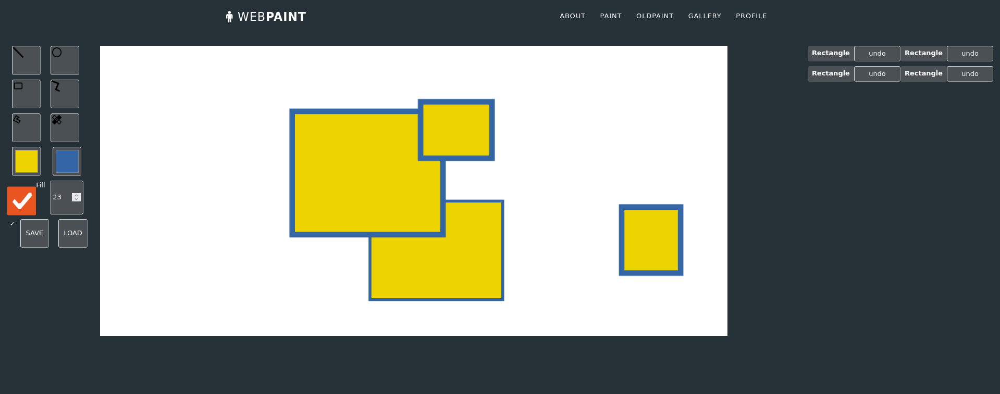

# DJANGO PAINT WEBSITE

## Description
PaintWeb is a site made for posting your own pictures, which supports its own drawing tool and the ability to profile and comment on other people's work.
### Picture board

On the category page, you can search by the word in the titles and description.

### Profile

On the profile page you can change your posts or delete them.

Actions to change the account are also available. 
User can change password, edit profile or delete it.

### Paint
On the paint page, the user can draw shapes, paint over them, undo/redo actions, and save or load the work in json format.
This application is written in javascript.

